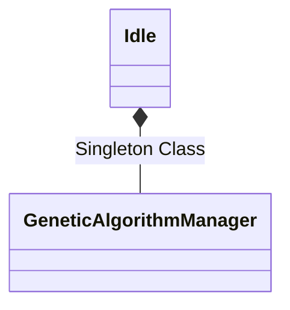

# Knapsack Problem With Genetic Algortihm

Solution of the Knapsack problem with Genetic Algorithm and State, Strategy,
Abstract Factory design patterns

## System Design

* [1. Problem Explanation](/systemDesign/knapsack.md)
* [3. Rough Drawing](https://miro.com/app/board/uXjVNGdVCg4=/?share_link_id=657114321129)
* [2. Class Diagram](/systemDesign/classDiagram.md)

## JavaDoc

https://atagunay.github.io/knapsack/doc/index.html

## Getting Started

1. Configure Genetic algorithm variables in main file

```java
public class Main {
    public static void main(String[] args) {
        // Set constant variables
        GeneticAlgorithmSettings.REPRODUCTION_RATE = 0.25;
        GeneticAlgorithmSettings.MUTATION_RATE = 0.10;
        GeneticAlgorithmSettings.CROSSOVER_RATE = 0.50;
    }
}
```

2. Configure Knapsack problem variables in main file

```java
public class Main {
    public static void main(String[] args) {
        // Set constant variables
        GeneticAlgorithmSettings.REPRODUCTION_RATE = 0.25;
        GeneticAlgorithmSettings.MUTATION_RATE = 0.10;
        GeneticAlgorithmSettings.CROSSOVER_RATE = 0.50;

        KnapsackSettings.WEIGHT1 = 7;
        KnapsackSettings.WEIGHT2 = 2;
        KnapsackSettings.WEIGHT3 = 1;
        KnapsackSettings.WEIGHT4 = 9;

        KnapsackSettings.VALUE1 = 5;
        KnapsackSettings.VALUE2 = 4;
        KnapsackSettings.VALUE3 = 7;
        KnapsackSettings.VALUE4 = 2;
    }
}
```

3. Create a Genetic Algorithm Instance and run it

```java
public class Main {
    public static void main(String[] args) {
        // Set constant variables
        GeneticAlgorithmSettings.REPRODUCTION_RATE = 0.25;
        GeneticAlgorithmSettings.MUTATION_RATE = 0.10;
        GeneticAlgorithmSettings.CROSSOVER_RATE = 0.50;

        KnapsackSettings.WEIGHT1 = 7;
        KnapsackSettings.WEIGHT2 = 2;
        KnapsackSettings.WEIGHT3 = 1;
        KnapsackSettings.WEIGHT4 = 9;

        KnapsackSettings.VALUE1 = 5;
        KnapsackSettings.VALUE2 = 4;
        KnapsackSettings.VALUE3 = 7;
        KnapsackSettings.VALUE4 = 2;

        // Select problem to solve with GA
        GeneticAlgorithm ga = new GeneticAlgorithm("knapsack");

        // Run GA
        // Idle to complete state
        ga.nextStep();

        // Complete to idle state
        ga.nextStep();
    }
}
```

4. Expected Output

* Program output indicates index of the elements in the knapsack
* Example:
  * [0,1,1,1] = Take second, thirth and fourth items. Leave first item.

```
VOILA!!! You have completed your Genetic Algorithm Process
You Genetic Algorithm Settings:
Crossover Rate: 0.5
Mutation Rate: 0.1
Reproduction Rate: 0.25
Program Output: [0, 1, 1, 1]
Idle -> Complete
Complete -> Idle
```

## Singleton Pattern



 