# Knapsack Problem With Genetic Algortihm

Solution of the Knapsack problem with Genetic Algorithm and State, Strategy,
Abstract Factory design patterns

## System Design

* [1. Problem Explanation](systemDesign/knapsack.md)
* [2. Rough Drawing](https://miro.com/app/board/uXjVNGdVCg4=/?share_link_id=657114321129)
* [3. Class Diagram](systemDesign/classDiagram.md)

## JavaDoc

https://atagunay.github.io/knapsack/doc/index.html

## Getting Started

1. Configure Genetic algorithm variables in main file

```java
public class Main {
    public static void main(String[] args) {
        // Set constant variables
        GeneticAlgorithmSettings.REPRODUCTION_RATE = 0.25;
        GeneticAlgorithmSettings.MUTATION_RATE = 0.10;
        GeneticAlgorithmSettings.CROSSOVER_RATE = 0.50;
    }
}
```

2. Configure Knapsack problem variables in main file

```java
public class Main {
    public static void main(String[] args) {
        // Set constant variables
        GeneticAlgorithmSettings.REPRODUCTION_RATE = 0.25;
        GeneticAlgorithmSettings.MUTATION_RATE = 0.10;
        GeneticAlgorithmSettings.CROSSOVER_RATE = 0.50;

        KnapsackSettings.WEIGHT1 = 7;
        KnapsackSettings.WEIGHT2 = 2;
        KnapsackSettings.WEIGHT3 = 1;
        KnapsackSettings.WEIGHT4 = 9;

        KnapsackSettings.VALUE1 = 5;
        KnapsackSettings.VALUE2 = 4;
        KnapsackSettings.VALUE3 = 7;
        KnapsackSettings.VALUE4 = 2;
    }
}
```

3. Create a Genetic Algorithm Instance and run it

```java
public class Main {
    public static void main(String[] args) {
        // Set constant variables
        GeneticAlgorithmSettings.REPRODUCTION_RATE = 0.25;
        GeneticAlgorithmSettings.MUTATION_RATE = 0.10;
        GeneticAlgorithmSettings.CROSSOVER_RATE = 0.50;

        KnapsackSettings.WEIGHT1 = 7;
        KnapsackSettings.WEIGHT2 = 2;
        KnapsackSettings.WEIGHT3 = 1;
        KnapsackSettings.WEIGHT4 = 9;

        KnapsackSettings.VALUE1 = 5;
        KnapsackSettings.VALUE2 = 4;
        KnapsackSettings.VALUE3 = 7;
        KnapsackSettings.VALUE4 = 2;

        // Select problem to solve with GA
        GeneticAlgorithm ga = new GeneticAlgorithm("knapsack");

        // Run GA
        // Idle to complete state
        ga.nextStep();

        // Complete to idle state
        ga.nextStep();
    }
}
```

4. Expected Output

* Program output indicates index of the elements in the knapsack
* Example:
  * [0,1,1,1] = Take second, thirth and fourth items. Leave first item.

```
VOILA!!! You have completed your Genetic Algorithm Process
You Genetic Algorithm Settings:
Crossover Rate: 0.5
Mutation Rate: 0.1
Reproduction Rate: 0.25
Program Output: [0, 1, 1, 1]
Idle -> Complete
Complete -> Idle
```

## State Pattern
1. A Genetic Algorithm process may have some states like idle and complete to inform the client developer

Document Links:
* [State Package](https://atagunay.github.io/knapsack/doc/state/package-summary.html)


## Singleton Pattern

1. GeneticAlgorithmManager class can be used by the different classes or threads to manage the Genetic Algorithm process
2. Creating new instances of GeneticAlgorithmManager for every new Genetic Algortihm will be redundant. For this reason, 
Singleton Pattern is used here

Document Links:
* [Singleton Class](https://atagunay.github.io/knapsack/doc/genetic/GeneticAlgorithmManager.html)


## Strategy Pattern

1. Next generation process has some behaviours/algorithms like mutation, crossover, selection
2. These algorithms can be changed on runtime
3. We may want to use different algorithms inside the next generation process. For this reason Strategy Pattern is used here

Document Links:
* [NextGeneration Class](https://atagunay.github.io/knapsack/doc/genetic/NextGeneration.html)
* [Behaviour Package](https://atagunay.github.io/knapsack/doc/behaviour/package-summary.html)


## Abstract Factory Pattern

1. Genetic Algorithm factory may create different families like knapsack family or travelling salesman family
2. Each family should have some products like selection, crossover and mutation. For this reason, 
Abstract Factory Pattern is used here

Document Links:
* [Concrete Factory and Products](https://atagunay.github.io/knapsack/doc/knapsack/package-summary.html)
* [Abstract Factory and Products](https://atagunay.github.io/knapsack/doc/genetic/package-summary.html)

```mermaid
classDiagram
    GeneticAlgorithmFactory <|.. KnapsackFactory: implement
    KSInitialPopulation <.. KnapsackFactory: create
    KSFitnessCalculation <.. KnapsackFactory: create
    KSResultDetection <.. KnapsackFactory: create
    KSNextGeneration <.. KnapsackFactory: create
    InitialPopulation <|-- KSInitialPopulation: extend
    FitnessCalculation <|-- KSFitnessCalculation: extend
    NextGeneration <|-- KSNextGeneration: extend
    ResultDetection <|-- KSResultDetection: extend
```



 