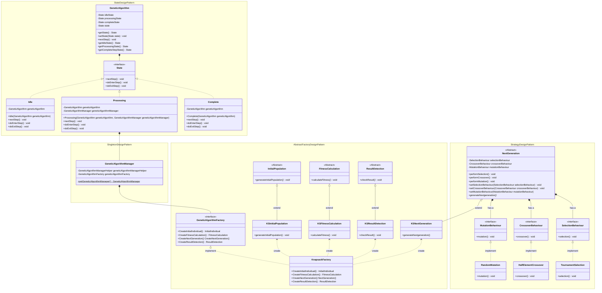

# Class Diagram

## Rough Drawing

```mermaid
classDiagram
    State <|.. Idle
    State <|.. Processing
    State <|.. Complete
    GeneticAlgorithm *-- State
    Processing *-- GeneticAlgorithmManager
    GeneticAlgorithmFactory <|.. KnapsackFactory : implement
    InitialPopulation <|-- KSInitialPopulation : extend
    FitnessCalculation <|-- KSFitnessCalculation : extend
    NextGeneration <|-- KSNextGeneration : extend
    ResultDetection <|-- KSResultDetection : extend
    KSInitialPopulation <.. KnapsackFactory : create
    KSFitnessCalculation <.. KnapsackFactory : create
    KSResultDetection <.. KnapsackFactory : create
    KSNextGeneration <.. KnapsackFactory : create
    GeneticAlgorithmManager *-- GeneticAlgorithmFactory
    NextGeneration *-- SelectionBehaviour : has-a
    NextGeneration *-- CrossoverBehaviour : has-a
    NextGeneration *-- MutationBehaviour : has-a
    MutationBehaviour <|.. RandomMutation : implement
    CrossoverBehaviour <|.. HalfElementCrossover : implement
    SelectionBehaviour <|.. TournamentSelection : implement

    namespace State Design Pattern {
        class GeneticAlgorithm {
            -State idleState
            -State processingState
            -State completeState
            -State state
            +getState() State
            +setState(State state) void
            +nextStep() void
            +getIdleState() State
            +getProcessingState() State
            +getCompleteStepState() State
        }

        class State {
            <<interface>>
            +nextStep() void
            +doEnterStep() void
            +doExitStep() void
        }

        class Idle {
            -GeneticAlgorithm geneticAlgortihm
            +Idle(GeneticAlgorithm geneticAlgortihm)
            +nextStep() void
            +doEnterStep() void
            +doExitStep() void
        }

        class Processing {
            -GeneticAlgorithm geneticAlgortihm
            -GeneticAlgorithmManager geneticAlgorithmManager
            +Processing(GeneticAlgorithm geneticAlgortihm, GeneticAlgorithmManager geneticAlgorithmManager)
            +nextStep() void
            +doEnterStep() void
            +doExitStep() void
        }

        class Complete {
            -GeneticAlgorithm geneticAlgortihm
            +Complete(GeneticAlgorithm geneticAlgortihm)
            +nextStep() void
            +doEnterStep() void
            +doExitStep() void
        }
    }

%% Use inner class with Bill Pugh Method
    namespace Singleton Design Pattern{
        class GeneticAlgorithmManager {
            -GeneticAlgorithmManagerHelper geneticAlgorithmManagerHelper
            -GeneticAlgorithmFactory geneticAlgorithmFactory
            +getGeneticAlgorithmManager() GeneticAlgorithmManager$
        }
    }

    namespace Abstract Factory Design Pattern{
        class GeneticAlgorithmFactory{
            <<interface>>
            +CreateInitialIndividual() InitialIndividual
            +CreateFitnessCalculation() FitnessCalculation
            +CreateNextGeneration() CreateNextGeneration()
            +CreateResultDetection() ResultDetection
        }

        class KnapsackFactory{
            +CreateInitialIndividual() InitialIndividual
            +CreateFitnessCalculation() FitnessCalculation
            +CreateNextGeneration() NextGeneration()
            +CreateResultDetection() ResultDetection
        }

        class KSInitialPopulation{
            +generateInitialPopulation() void
        }

        class KSFitnessCalculation{
            +calculateFitness() void
        }

        class KSNextGeneration{
            +generateNextgeneration()
        }

        class KSResultDetection{
            +checkResult() void
        }

        class ResultDetection{
            <<Abstract>>
            +checkResult() void*
        }

        class InitialPopulation{
            <<Abstract>>
            +generateInitialPopulation() void*
        }

        class FitnessCalculation{
            <<Abstract>>
            +calculateFitness() void*
        }
    }

    namespace Strategy Design Pattern {
        class NextGeneration{
            <<Abstract>>
            -SelectionBehaviour selectionBehaviour
            -CrossoverBehaviour crossoverBehaviour
            -MutationBehaviour mutationBehaviour
            +performSelection() void
            +performCrossover() void
            +performMutation() void
            +setSelectionBehaviour(SelectionBehaviour selectionBehaviour) void
            +setCrossoverBehaviour(CrossoverBehaviour crossoverBehaviour) void
            +setMutationBehaviour(MutationBehaviour mutationBehaviour)
            +generateNextgeneration()*
        }

        class SelectionBehaviour{
            <<interface>>
            +selection() void
        }

        class CrossoverBehaviour{
            <<interface>>
            +crossover() void
        }

        class MutationBehaviour{
            <<interface>>
            +mutation() void
        }

        class RandomMutation{
            +mutation() void
        }

        class HalfElementCrossover{
            +crossover() void
        }

        class TournamentSelection{
            +selection() void
        }
    }
```