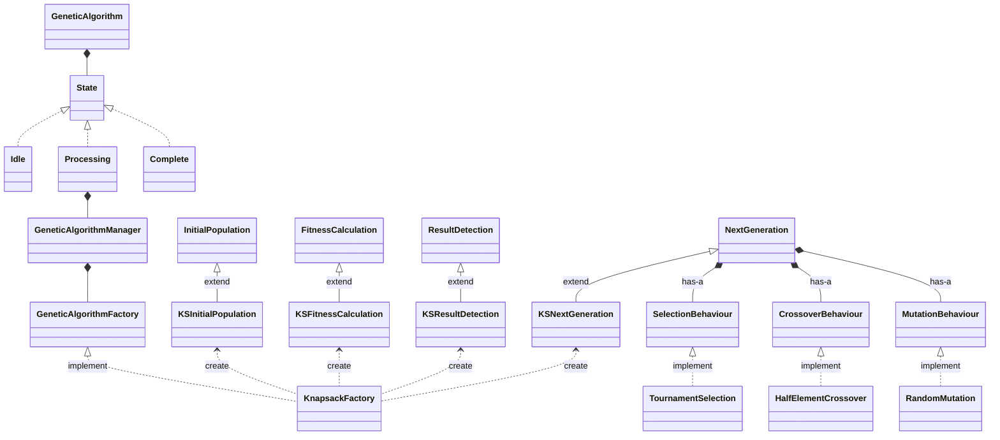

# Class Diagram

## Rough Drawing

```mermaid
classDiagram
    State <|.. Idle
    State <|.. Processing
    State <|.. Complete
    GeneticAlgorithm *-- State
    Processing *-- GeneticAlgorithmManager
    GeneticAlgorithmFactory <|.. KnapsackFactory : implement
    InitialPopulation <|-- KSInitialPopulation : extend
    FitnessCalculation <|-- KSFitnessCalculation : extend
    NextGeneration <|-- KSNextGeneration : extend
    ResultDetection <|-- KSResultDetection : extend
    KSInitialPopulation <.. KnapsackFactory : create
    KSFitnessCalculation <.. KnapsackFactory : create
    KSResultDetection <.. KnapsackFactory : create
    KSNextGeneration <.. KnapsackFactory : create
    GeneticAlgorithmManager *-- GeneticAlgorithmFactory
    NextGeneration *-- SelectionBehaviour : has-a
    NextGeneration *-- CrossoverBehaviour : has-a
    NextGeneration *-- MutationBehaviour : has-a
    MutationBehaviour <|.. RandomMutation : implement
    CrossoverBehaviour <|.. HalfElementCrossover : implement
    SelectionBehaviour <|.. TournamentSelection : implement

```