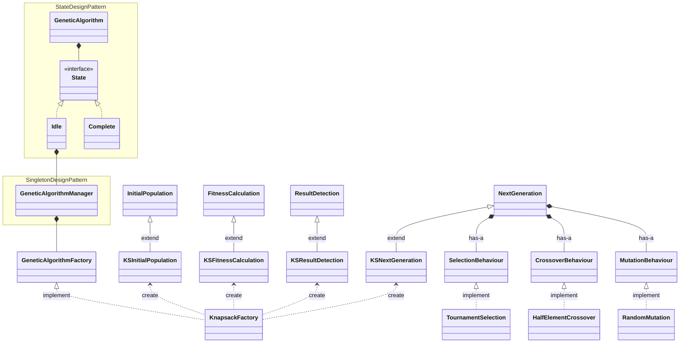

# Class Diagram

## Rough Drawing

```mermaid
classDiagram
    State <|.. Idle
    State <|.. Complete
    GeneticAlgorithm *-- State
    Idle *-- GeneticAlgorithmManager
    GeneticAlgorithmFactory <|.. KnapsackFactory: implement
    InitialPopulation <|-- KSInitialPopulation: extend
    FitnessCalculation <|-- KSFitnessCalculation: extend
    NextGeneration <|-- KSNextGeneration: extend
    ResultDetection <|-- KSResultDetection: extend
    KSInitialPopulation <.. KnapsackFactory: create
    KSFitnessCalculation <.. KnapsackFactory: create
    KSResultDetection <.. KnapsackFactory: create
    KSNextGeneration <.. KnapsackFactory: create
    GeneticAlgorithmManager *-- GeneticAlgorithmFactory
    NextGeneration *-- SelectionBehaviour: has-a
    NextGeneration *-- CrossoverBehaviour: has-a
    NextGeneration *-- MutationBehaviour: has-a
    MutationBehaviour <|.. RandomMutation: implement
    CrossoverBehaviour <|.. HalfElementCrossover: implement
    SelectionBehaviour <|.. TournamentSelection: implement

    namespace State Design Pattern {
        class GeneticAlgorithm
        class Idle
        class Complete

        class State {
            <<interface>>
        }
    }

    namespace Singleton Design Pattern {
        class GeneticAlgorithmManager
    }
```